<div align="center">

</div>

<div align="center">

[](https://git.io/typing-svg)

</div>

<div align="center">


</div>

---

<table>
<tr>
<td width="50%" valign="top">


</td>
<td width="50%" valign="top">



</td>
</tr>
</table>

<div align="center">

[](https://tinyurl.com/3f7mef97)
[](mailto:hrasheed0702@gmail.com)
[](https://github.com/HaroonRasheed-hr)

</div>

---

## 🆕 Latest Repositories

<!--START_SECTION:repos-->
- [Image-Annotator](https://github.com/HaroonRasheed-hr/Image-Annotator) - AI-powered image annotation platform with automated labeling `Python`
- [chip-defect-finder](https://github.com/HaroonRasheed-hr/chip-defect-finder) - AI model inference for detecting chip defects `Python`
- [Skill-dev](https://github.com/HaroonRasheed-hr/Skill-dev) - Skill development platform `Python`
- [Servies-Management-](https://github.com/HaroonRasheed-hr/Servies-Management-) - Service management system `TypeScript`
- [Educational-website](https://github.com/HaroonRasheed-hr/Educational-website) - Full-stack service booking system with a Spring Boot backend and MySQL database `HTML`
<!--END_SECTION:repos-->

<div align="center">
<sub>⚙️ Auto-synced — updates automatically whenever a new repo is created</sub>
</div>

---

## 🧠 About Me

> *Backend Engineer specializing in Python, Django, and FastAPI. I design and ship scalable REST APIs, integrate AI models into production inference pipelines, and build real-time systems with MQTT.*

- 🎓 **BS Software Engineering**, University of Okara (2021 – 2025)
- 💼 **Full Stack Intern (Backend Focused)** at **Xis.ai** (04/2026 – 09/2026)
- ⚙️ Experienced in workflow automation, CI/CD, and optimizing services under load
- 📍 Lahore, Pakistan · Open to backend roles

---

## 💼 Experience

### Full Stack Intern (Backend Focused) — Xis.ai · *04/2026 – 09/2026 · Remote*
- Built backend services with **Django, DRF, and PostgreSQL** across 5 modules, with React.js on the front end where needed
- Designed and shipped **100+ RESTful endpoints** for authentication, inspection workflows, and reporting
- Integrated **4+ pre-trained models** for pass/fail image inference, cutting manual inspection time by **~70%**
- Engineered **MQTT** infrastructure for real-time notifications, system monitoring, and error reporting
- Built PDF report generation, model conversion, and automated frame-capture pipelines, cutting report generation from **90s to 20s**

### Software Engineer Intern — Techworks · *10/2025 – 01/2026 · Remote*
- Delivered client automation and AI integration projects using **n8n, Zapier, and Make.com**
- Built web applications and integrated third-party APIs into scalable systems
- Automated business workflows, cutting manual effort and improving operational efficiency

---

## 🚀 Featured Projects

<div align="center">

| 🔥 Project | 📝 Description | 🛠 Stack |
|:---|:---|:---|
| **Ctrlx Radar** | Backend API layer with ONNX model inference endpoints, JWT auth, and tests for API and inference flows | Python, ONNX, JWT |
| **Vision Pulse** | Backend for an AI-powered image annotation platform with RBAC, model integration, and MQTT real-time services | Python, MQTT, Docker |
| **[Services Management System](https://github.com/HaroonRasheed-hr/Educational-website)** | Service booking app with role-based access (user, company, admin), approvals, and notifications. Final Year Project | Spring Boot, MySQL, JS |

</div>

---

## 🛠️ Tech Stack

### ⚙️ Languages & Frameworks


### 🗄️ Databases


### 🔌 Real-Time & AI


### 🧰 Tools & Platforms


---

## 📊 GitHub Stats

<div align="center">
  
  
</div>

### 💻 Most Used Languages

```text
Python / Django  ████████████████████████████████░░░░░░░░  80%
TypeScript       ████████░░░░░░░░░░░░░░░░░░░░░░░░░░░░░░░░  20%
```

---

## 🌐 Let's Connect

<div align="center">

[](https://tinyurl.com/3f7mef97)
[](mailto:hrasheed0702@gmail.com)
[](https://github.com/HaroonRasheed-hr)

</div>

---

<div align="center">

</div>
